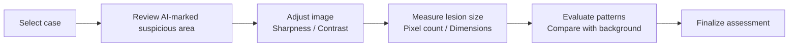

# 👩‍⚕️ MediBridge Training – Clinicians

This training module is designed for **clinicians** (urologists, surgeons, radiologists) who use MediBridge in daily practice.  
It provides a safe environment to practice ultrasound workflows and learn how to interpret AI‑assisted findings.

## 🎯 Purpose
- Support clinicians in identifying suspicious areas on ultrasound scans  
- Demonstrate how AI can assist but not replace clinical judgment  
- Provide hands-on practice with image adjustments and measurements  

## 🩺 Case: Male with suspicious areas
- Ultrasound shows suspicious regions  
- AI has flagged the scan as *“must be seen by clinician”*  
- Clinician reviews the scan, adjusts sharpness/contrast, measures lesion size, and evaluates patterns  

## 🔄 Training Flow

## 📈 Outcome
Clinicians gain confidence in:

- Reviewing AI suggestions
- Using software tools to enhance image quality
- Making accurate measurements and clinical decisions
